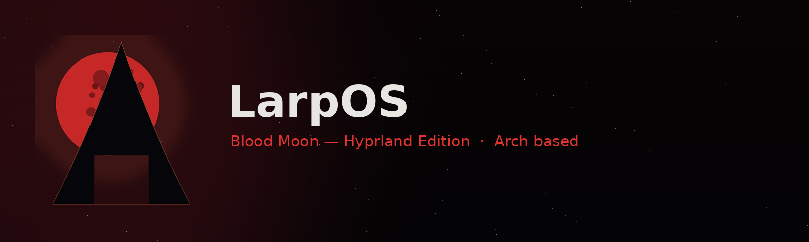

# LarpOS Linux Edition

**Arch-based live distribution with a blood moon soul.**

## About

LarpOS is an Arch-based live ISO with a polished out-of-the-box experience:
a beautiful Hyprland desktop, a graphical Calamares installer and a curated
set of applications. Everything works straight after boot - no setup required.

## Features

- **Hyprland** - modern Wayland compositor with smooth animations
- **Waybar + Wofi** - status bar and app launcher, themed for LarpOS
- **Calamares** - friendly graphical installer (CachyOS style)
- **greetd + tuigreet** - minimal login manager
- **Kitty + fastfetch** - terminal with branded system info
- **Audio ready** - PipeWire stack out of the box
- **Preinstalled tools** - Docker, GIMP, Inkscape, LibreOffice, 7zip

## Quick start

1. Download the latest ISO from the [Releases](../../releases) page
2. Write it to a USB stick (Rufus / Ventoy / `dd`) or attach it to VirtualBox
3. Boot - you will be logged in automatically as `liveuser`
4. Click **Install LarpOS** in the app menu to install to disk

## Screenshots & branding

The logo is a reworked arch rising over a blood moon.

## Roadmap

- [x] v1.0 - first bootable release
- [ ] Hyprland visual polish (animations, bar, launcher)
- [ ] Wallpaper pack
- [ ] LarpOS Hello - built-in app installer with project info

## License

See [LICENSE](LICENSE).
